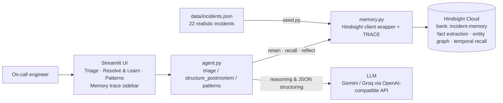

# Hindsight Incident Responder

MVP LINK : https://hindsight-incident-responder-i238mtgbanxwt3bh2nklz9.streamlit.app/

An on-call agent that remembers every past production incident — root causes, the fix that
worked, the fixes that **didn't** — and gets measurably better after every post-mortem.
Memory is provided by [Hindsight agent memory](https://github.com/vectorize-io/hindsight)
from Vectorize.

> Same LLM, same alert. Without memory: "roll back and restart". With memory:
> "set `DB_POOL_MAX=60` (INC-017), don't bother restarting pods — that failed in INC-017 and
> INC-031, and this is the third time a worker-count change caused it."

## The problem

When production breaks at 2 AM, the fix usually already exists — in a post-mortem nobody reads
during an outage, or in the head of an engineer who is asleep or has left. On-call engineers
rediscover known fixes, repeat known dead ends, and miss that the same failure keeps recurring.

## What the agent does

| Tab | What happens | Hindsight call |
|---|---|---|
| **Triage** | Paste an alert → agent recalls similar incidents, ranks fixes by what actually worked, lists known dead ends with citations, and flags recurring patterns | `recall` |
| **Amnesia vs Hindsight** | Same alert answered with and without memory, side by side | — |
| **Resolve & Learn** | Free-text post-mortem + worked/failed feedback → structured incident → reviewed by a human → stored | `retain` |
| **Patterns** | "Why does payment-service keep going down?" answered from accumulated experience | `reflect` |
| **Memory trace** | Live log of every retain / recall / reflect with payload and latency | — |

## How Hindsight memory is used

Memory is the product, not a feature. Everything that makes the agent useful comes from Hindsight.

**1. Retain — structured, entity-rich memories (`memory.py: incident_to_memories`).**
Each incident is split into two focused memories rather than one blob: a *diagnosis* memory
(symptoms, exact error strings, root cause) and a *resolution* memory (steps that worked,
runbook, **attempts that failed**, lesson). Each carries metadata (`incident_id`, `service`,
`severity`, `tags`) and a timestamp. Hindsight extracts facts and entities from these, so a
later query phrased differently from the post-mortem still finds them.

**2. Recall — grounding triage in experience (`agent.py: triage`).**
The raw alert text is the recall query. Retrieved memories are injected into the triage prompt
with strict rules: cite an incident ID for every step, rank by what worked, put every literally
stated failed attempt into "don't bother trying", never attribute anything to an incident that
doesn't contain it. The "Amnesia" column runs the identical prompt with no memories.

**3. Retain again — the learning loop (`agent.py: structure_postmortem`, `app.py`).**
After an incident, the engineer marks each suggested step worked/failed and writes a free-text
post-mortem. The LLM converts it to the same structured shape, the engineer **reviews the JSON
before anything is stored** (a wrong memory means wrong advice forever), and it is retained.
The next triage of a similar alert cites the new incident.

**4. Reflect — patterns across incidents (`agent.py: patterns`).**
Hindsight's `reflect` reasons over the whole bank to answer questions like which runbook gets
misapplied or why a service keeps failing — synthesis that no single retrieved memory contains.

**What memory changes in practice (from the seeded data):**
- Recurring alert → cites INC-017/031/051, exact config keys, and a prevention step (`source: pattern`).
- Look-alike alert (same `PaymentService 5xx` alert, TLS cause) → matches INC-044 only and warns
  that `RB-DB-POOL` was misapplied for 12 minutes last time.
- After a new post-mortem is retained, the same alert immediately cites it.

## Architecture



## Run it

```bash
pip install -r requirements.txt
cp .env.example .env          # fill in Hindsight Cloud URL + key, LLM key
python test_memory.py         # smoke test: retain → recall → reflect
python seed.py                # load 22 past incidents into Hindsight
streamlit run app.py
```

`.env`:
```
HINDSIGHT_BASE_URL=https://api.hindsight.vectorize.io
HINDSIGHT_API_KEY=...
HINDSIGHT_BANK_ID=incident-memory
LLM_PROVIDER=gemini            # or groq / openai
LLM_API_KEY=...
LLM_MODEL=gemini-3.5-flash-lite
```

## Project structure

```
app.py              Streamlit UI (3 tabs + live memory trace)
agent.py            triage(), structure_postmortem(), resolve(), patterns()
memory.py           Hindsight wrapper: retain / recall / reflect, incident → memories, TRACE
prompts.py          Triage (with/without memory) and post-mortem structuring prompts
llm.py              OpenAI-compatible client with defensive JSON parsing
seed.py             Loads data/incidents.json into the memory bank
test_memory.py      End-to-end smoke test
data/incidents.json 22 incidents across 9 services, with recurring patterns and look-alikes
```

## Data

Twenty-two synthetic but realistic incidents across payment-service, auth-service, search-api,
api-gateway, order-service, checkout-web, notification-worker, inventory-service and
recommendation-api. The set is designed to exercise memory, not just search:
- **Recurring classes** (payment-service pool exhaustion ×3, auth Redis TTL ×2, gateway config drift ×2)
- **Look-alikes** with identical alerts but different root causes (INC-044 vs INC-017; INC-033 vs INC-022)
- **Explicit dead ends** in almost every incident, so the agent can say what *not* to do
- **Learning evidence** (INC-054 resolved in 6 min by applying the INC-036 lesson)

## Lessons and limitations

- **Bad memory is worse than no memory.** An early version stored an empty post-mortem template;
  the LLM invented a root cause and runbook, and that fabricated incident polluted every later
  triage. That is why retention is now a two-step review and the structuring prompt is forbidden
  from guessing. Memory systems need an ingestion gate.
- **Memory quality is data quality.** Recall improved dramatically once memories contained exact
  error strings, config keys and service names rather than prose.
- **Recall is probabilistic.** Which of the 22 incidents come back varies slightly between runs;
  widening recall (`top_k=12`) and citing metadata IDs made citations stable.
- Not yet built: PagerDuty/Slack ingestion, per-team banks, automatic post-mortem import from
  Confluence/Notion, confidence calibration against actual resolution times.

## Links

- Hindsight on GitHub: https://github.com/vectorize-io/hindsight
- Hindsight documentation: https://hindsight.vectorize.io/
- What is agent memory: https://vectorize.io/what-is-agent-memory
